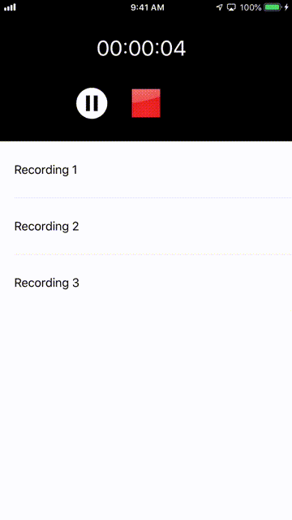

# RecordMe
Using AVFoundation to create my personal recording app, implementing data persistence with App Sandboxing.

- User's can record voice memos.
- User's can play saved recordings.
- Ability to pause(), resume(), and stop() audio recorder and audio player.
- UIAlert handler: Long press on item to delete recording.
- Notification/Observer onRouteChange (Headphones connected/disconnected).

### Skills
* AVFoundation
* Notifications/Observers
* Auto Layout
* MVC Design Pattern
* Custom Cells
* Persistent Local Data Storage (UserDefaults, FileManager/Sandboxing)

## Finished App

Copyright © Hector Mendoza
